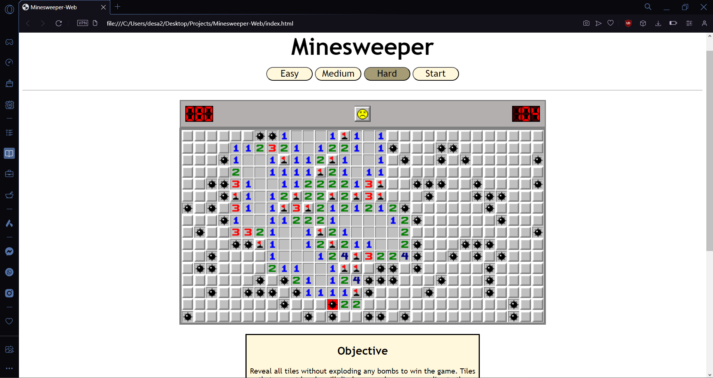
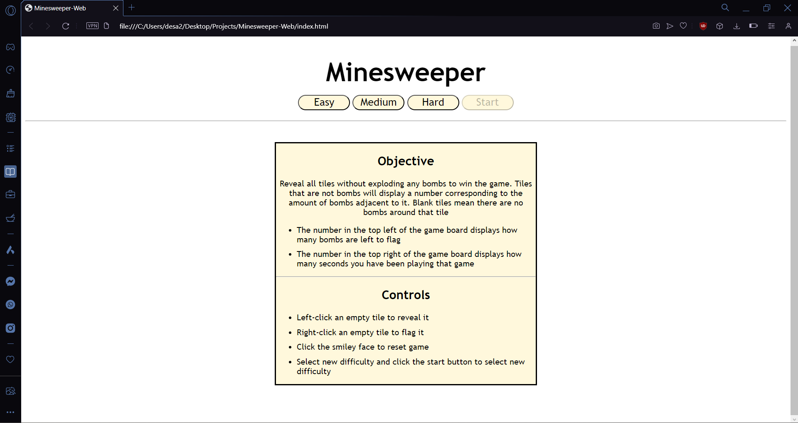

# [Minesweeper-Web](https://desa-thomas.github.io/Minesweeper-Web/)
Classic Minesweeper game made with HMTL and Javascript. Click the link to go the Github Pages!

 

  

## Getting Started
1. Download the repository: click `<> Code`, then `Download ZIP`
   
2. Unzip the folder
   
3. Run [index.html](index.html) with any browser
   
4. Select your difficulty:
    - Easy: 9x9 grid with 10 bombs
    - Medium 16x16 grid with 40 bombs
    - Hard 16x30 grid with 99 bombs 
5. Click Start and play the game!

 

  

